# SOT - Scope OSINT Training

<p align="center">
  
</p>

**SOT (Scope OSINT Training)** — десктоп-платформа для обучения разведке по открытым источникам (OSINT) с персональным AI-инструктором и библиотекой из 200 практических методик в 20 направлениях.

---

## Автор

Проект создан и поддерживается **scope_moon**:

- Telegram: [@scope_moon](https://t.me/scope_moon)
- Репозиторий: [github.com/x-cicada-ru/Scope-OSINT-Training](https://github.com/x-cicada-ru/Scope-OSINT-Training)

## Возможности

| Раздел | Описание |
|---|---|
| **Home** | Обзор платформы и быстрый доступ ко всем разделам |
| **AI Agent** | AI-инструктор: объясняет любую тему как преподаватель — теория, демонстрация, пошаговая методика, визуальная схема процесса (Mermaid-диаграммы рендерятся прямо в чате), таблица инструментов, разбор типичных ошибок и OPSEC, домашнее задание |
| **Documents of OSINT** | Библиотека знаний: 200 мануалов в 20 категориях (SOCMINT, GEOINT, IMINT, CRYPTO, DARKWEB, DIGITAL_FORENSICS и др.) с поиском, фильтрами и чтением внутри приложения |
| **Documents of Criminology** | Справочник криминалистических методик |
| **Chat history** | История всех диалогов с инструктором — хранится локально |
| **Settings** | Внешний вид (8 тем оформления) и управление API-ключами |
| **Support** | Прямая связь с автором через Telegram |

## Технологии

Electron · JavaScript (ESM) · marked · highlight.js · Mermaid · NVIDIA NIM API

---

## Установка и запуск

### Требования

- [Node.js](https://nodejs.org) 18+
- npm (поставляется с Node.js)
- Ключ [NVIDIA NIM API](https://build.nvidia.com) (бесплатный, формат `nvapi-...`)

### Запуск из исходников

```bash
git clone https://github.com/x-cicada-ru/Scope-OSINT-Training.git
cd Scope-OSINT-Training
npm install
npm start
```

### Сборка установщика (Windows)

```bash
npm run build:win64
```

Готовый портативный exe появится в папке `dist/`.

---

## Использование

### Первый запуск

1. При первом старте приложение попросит API-ключ
2. Откройте **Settings → API ключи**
3. Получите бесплатный ключ на [build.nvidia.com](https://build.nvidia.com) (кнопка *Get API Key*)
4. Вставьте ключ в поле и нажмите **«Сохранить ключ»**

Ключ сохраняется локально в `user.json` и не покидает ваше устройство. В коде приложения ключей нет.

### Работа с AI-инструктором

1. Перейдите в раздел **AI Agent**
2. Задайте вопрос или тему урока, например:
   - «Как искать человека по нику в открытых источниках?»
   - «Расскажи про анализ метаданных изображений»
   - «Составь урок по геолокации по фото»
3. Инструктор ответит структурированным уроком со схемой-диаграммой, таблицей инструментов и домашним заданием
4. Можно продолжать диалог — инструктор помнит контекст беседы

### Работа с библиотекой

1. Откройте **Documents of OSINT**
2. Найдите нужную методику через поиск или фильтр по категории
3. Кликните по карточке — мануал откроется полностью оформленным текстом

### Персонализация

- **Settings → Внешний вид**: 8 цветовых тем, применяются мгновенно
- **Profile** (клик по аватару внизу меню): имя, email и фото профиля

---

## Структура проекта

```
├── main.js                  # Главный процесс: окна, IPC, стриминг LLM
├── preload.js               # Безопасный мост renderer ↔ main
├── index.html               # Каркас приложения
├── src/renderer/
│   ├── app.js               # Роутинг разделов
│   ├── sections.js          # Разделы: AI Agent, Settings, Support...
│   ├── dashboard.js         # Home
│   ├── theme.js             # Темы оформления
│   ├── utils.js             # Markdown/код/Mermaid-рендеринг
│   ├── criminology/         # Данные и рендерер криминалистики
│   └── OSINT/               # Markdown-корпус + генерируемый каталог
├── scripts/
│   └── gen-osint-data.mjs   # Сборка osintData.js из md-корпуса
└── styles/                  # CSS (layout, base, criminology)
```

Пересборка каталога OSINT после изменения md-файлов:

```bash
node scripts/gen-osint-data.mjs
```

---

## Правовая оговорка

SOT создан исключительно в **образовательных целях**. Все материалы описывают работу с общедоступными источниками информации. Использование материалов для незаконного доступа к данным, нарушения приватности или иных противоправных действий запрещено. Авторы не несут ответственности за неправомерное использование.

## Поддержка

Нашли баг или есть предложение? Пишите:

**Telegram: [@scope_moon](https://t.me/scope_moon)**

---

<p align="center">SOT - Scope OSINT Training © scope_moon</p>
